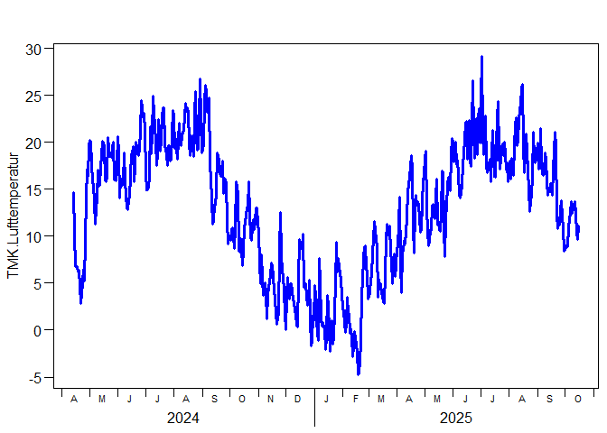
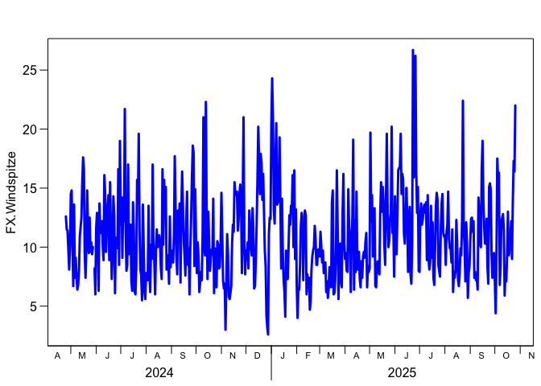
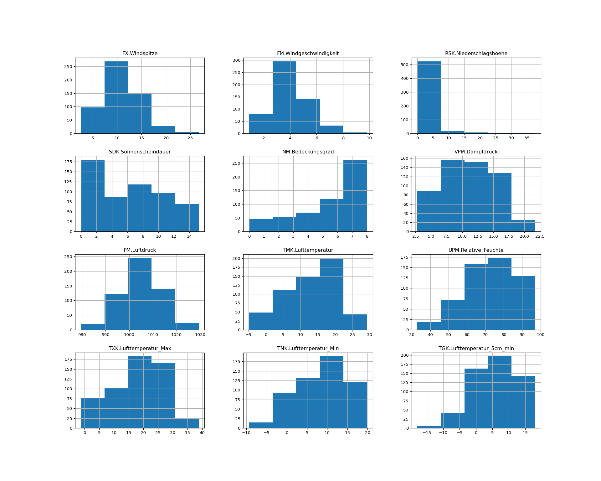

# Fundamentals of Programming October 2025
Berry Boessenkool
2025-10-23, 18:49

Hey everyone! Welcome to Fundamentals of Programming 2025/26!  
This is a github task in the course
[FP25](https://open.hpi.de/courses/hpi-dh-fprog2025).

*note that it is fine to not really understand the code at this point -
we’ll get to that throughout the course :)*

Please go through the new [installation
guide](https://github.com/brry/fpsetup#software-installation-guide)
first!

## Get weather data

``` r
if(!requireNamespace("rdwd", quietly=TRUE))
    install.packages("rdwd")
rdwd::updateRdwd()
```

download recent weather data using
[rdwd](https://bookdown.org/brry/rdwd/)

``` r
library(rdwd)
link <- selectDWD("Potsdam", res="daily", var="kl", per="recent")
clim <- dataDWD(link, varnames=TRUE, force=24)
```

## Visualise recent temperature

``` r
plotDWD(clim, "TMK.Lufttemperatur", ylab = "mean air temperature (in °C)", col = "darkgreen")
```



## Visualise recent Wind Speed

``` r
plotDWD(clim, "FX.Windspitze")
```



## Transfer to Python

``` python
clim_py = r.clim
import matplotlib
print(f"Dataset shape: {clim_py.shape[0]} rows, {clim_py.shape[1]} columns")
```

``` python
clim_py = clim_py.select_dtypes(include=['float64', 'int64'])
clim_py.hist(figsize=(20, 16), bins=5)
```



## Calculate Summary Statistics and Identify Extreme Days

``` python
# Calculate and display some basic statistics
print("\n=== Summary Statistics for Temperature ===")
```


    === Summary Statistics for Temperature ===

``` python
temp_stats = clim_py['TMK.Lufttemperatur'].describe()
print(temp_stats)
```

    count    550.000000
    mean      12.994545
    std        7.096378
    min       -4.800000
    25%        7.850000
    50%       14.150000
    75%       18.700000
    max       29.200000
    Name: TMK.Lufttemperatur, dtype: float64

``` python
# Find and display the maximum and minimum temperature days
print("\n=== Extreme Temperature Days ===")
```


    === Extreme Temperature Days ===

``` python
max_temp_idx = clim_py['TMK.Lufttemperatur'].idxmax()
min_temp_idx = clim_py['TMK.Lufttemperatur'].idxmin()

print(f"Hottest day: {r.clim.loc[max_temp_idx, 'MESS_DATUM']} with {clim_py.loc[max_temp_idx, 'TMK.Lufttemperatur']:.1f}°C")
```

    Hottest day: 2025-07-02 with 29.2°C

``` python
print(f"Coldest day: {r.clim.loc[min_temp_idx, 'MESS_DATUM']} with {clim_py.loc[min_temp_idx, 'TMK.Lufttemperatur']:.1f}°C")
```

    Coldest day: 2025-02-17 with -4.8°C

    Yazan added this chunk as part of the first homework

    ['a', 'b', 'c', 'd', 'e', 'f', 'g', 'h', 'i', 'j', 'k', 'l', 'm', 'n', 'o', 'p', 'q', 'r', 's', 't', 'u', 'v', 'w', 'x', 'y', 'z', 'A', 'B', 'C', 'D', 'E', 'F', 'G', 'H', 'I', 'J', 'K', 'L', 'M', 'N', 'O', 'P', 'Q', 'R', 'S', 'T', 'U', 'V', 'W', 'X', 'Y', 'Z']

    wishing everyone a good start
