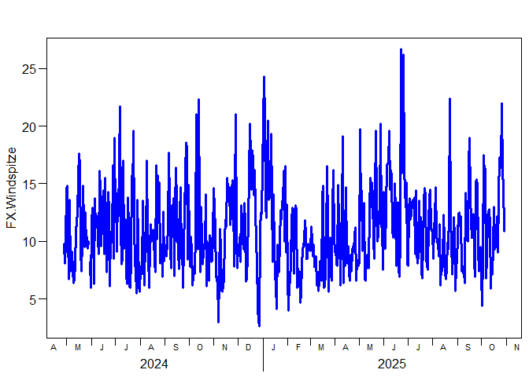

# Fundamentals of Programming 2025
Berry Boessenkool;
2025-10-20, 16:10

This is a github task in the course
[FP25](https://open.hpi.de/courses/hpi-dh-fprog2025).  

## Get weather data

<details class="code-fold">
<summary>Code</summary>

``` r
if(!requireNamespace("rdwd", quietly=TRUE))
    install.packages("rdwd")
rdwd::updateRdwd()
```

</details>

    rdwd is up to date, compared to github.com/brry/rdwd. Version 1.9.3 (2025-08-18)

download recent weather data using
[rdwd](https://bookdown.org/brry/rdwd/)

<details class="code-fold">
<summary>Code</summary>

``` r
library(rdwd)
```

</details>

    Warning: package 'rdwd' was built under R version 4.4.3

<details class="code-fold">
<summary>Code</summary>

``` r
link <- selectDWD("Potsdam", res="daily", var="kl", per="recent")
clim <- dataDWD(link, varnames=TRUE, force=24)
```

</details>

    Warning: .main -> execute -> knitr::knit -> process_file -> xfun:::handle_error
    -> process_group -> call_block -> block_exec -> dataDWD -> locdir: '~/DWDdata'
    does not exist, using tempdir() now.

    Warning: .main -> execute -> knitr::knit -> process_file -> xfun:::handle_error -> process_group -> call_block -> block_exec ->  dataDWD -> readDWD: R package 'data.table' available for fast reading of files, but system command 'unzip' could not be found. Now reading slowly.
    See   https://bookdown.org/brry/rdwd/fread.html

## visualise recent temperature

<details class="code-fold">
<summary>Code</summary>

``` r
plotDWD(clim, "TMK.Lufttemperatur")
```

</details>


## visualise recent Wind Speed

<details class="code-fold">
<summary>Code</summary>

``` r
plotDWD(clim, "FX.Windspitze", col="brown")
```

</details>



## transfer to Python

I use Python via the R package reticulate. All chill on Windows; On Mac,
I needed a manual install:

<details class="code-fold">
<summary>Code</summary>

``` r
if(FALSE){ # do not run this chunk accidentally (e.g in VS code)
install.packages("reticulate")
# check first:
reticulate::py_config()
reticulate::py_available(TRUE)
# potentially do the edit_r_environ below if you have a working Python path

# install Python if needed
reticulate::install_miniconda() # then do the tos thing in the terminal, then:
reticulate::install_miniconda(force=TRUE)
reticulate::use_miniconda(condaenv="r-reticulate", required=TRUE)
reticulate::py_config()
# Make Python choice permanent (normally happens automatically in the background):
usethis::edit_r_environ() # RETICULATE_PYTHON=~/Library/r-miniconda/envs/r-reticulate/bin/python

# Restart Rstudio, check if calling python works:
reticulate::py_available()
reticulate::py_eval("1+1")
reticulate::py_numpy_available(TRUE)
reticulate::py_numpy_available()

reticulate::py_install(c("numpy", "pandas", "matplotlib"))
}
```

</details>

On Windows / if you use the system Python, run in the terminal:

<details class="code-fold">
<summary>Code</summary>

``` bash
pip install pandas
pip install matplotlib
```

</details>

Back to the actual code:

<details class="code-fold">
<summary>Code</summary>

``` python
clim_py = r.clim
import matplotlib
print(f"Dataset shape: {clim_py.shape[0]} rows, {clim_py.shape[1]} columns")
```

</details>
<details class="code-fold">
<summary>Code</summary>

``` python
clim_py = clim_py.select_dtypes(include=['float64', 'int64'])
clim_py.hist(figsize=(20, 16), bins=5)
```

</details>


