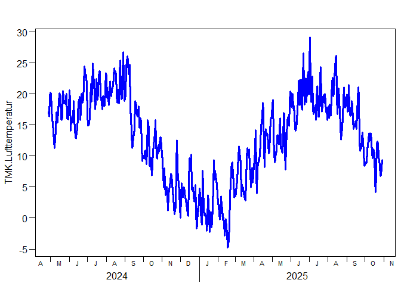

# Fundamentals of Programming 2025
Berry Boessenkool;
2025-11-05, 13:32

This is a github task in the course
[FP25](https://open.hpi.de/courses/hpi-dh-fprog2025).

*note that it is fine to not really understand the code at this point -
we’ll get to that throughout the course :)*

Please go through the new [installation
guide](https://github.com/brry/fpsetup#software-installation-guide)
first!

Please **pull** before you **push**!!!!

See [here](https://github.githistory.xyz/brry/FP25/blob/main/README.qmd)
for a nicely animated version history (works for any file on github).
Sorry if your edits got lost in my clean-up - feel free to add them
again.

## load modules / packages

``` python
import matplotlib, pandas
```

<details class="code-fold">
<summary>Code</summary>

``` r
if(!requireNamespace("rdwd", quietly=TRUE))
    install.packages("rdwd")
rdwd::updateRdwd()
```

</details>

## Get weather data

download recent weather data using
[rdwd](https://bookdown.org/brry/rdwd/)

``` r
library(rdwd)
link <- selectDWD("Potsdam", res="daily", var="kl", per="recent")
clim <- dataDWD(link, varnames=TRUE, force=24, removeftp=TRUE) 
```

## Visualise recent temperature

``` r
plotDWD(clim, "TMK.Lufttemperatur", col="green")
```



## Transfer to Python

``` python
clim_py = r.clim
print(f"Dataset shape: {clim_py.shape[0]} rows, {clim_py.shape[1]} columns")
```

``` python
clim_py = clim_py.select_dtypes(include=['float64', 'int64'])
clim_py.hist(figsize=(20, 16), bins=5)
```


## Calculate summary statistics and identify extreme days

``` python
# Calculate and display some basic statistics
print("\n=== Summary Statistics for Temperature ===")
temp_stats = clim_py['TMK.Lufttemperatur'].describe()
print(temp_stats)

# Find and display the maximum and minimum temperature days
print("\n=== Extreme Temperature Days ===")
max_temp_idx = clim_py['TMK.Lufttemperatur'].idxmax()
min_temp_idx = clim_py['TMK.Lufttemperatur'].idxmin()

print(f"Hottest day: {r.clim.loc[max_temp_idx, 'MESS_DATUM']} with {clim_py.loc[max_temp_idx, 'TMK.Lufttemperatur']:.1f}°C")
print(f"Coldest day: {r.clim.loc[min_temp_idx, 'MESS_DATUM']} with {clim_py.loc[min_temp_idx, 'TMK.Lufttemperatur']:.1f}°C")
```


    === Summary Statistics for Temperature ===
    count    550.000000
    mean      12.921636
    std        7.053559
    min       -4.800000
    25%        8.025000
    50%       13.800000
    75%       18.600000
    max       29.200000
    Name: TMK.Lufttemperatur, dtype: float64

    === Extreme Temperature Days ===
    Hottest day: 2025-07-02 with 29.2°C
    Coldest day: 2025-02-17 with -4.8°C
